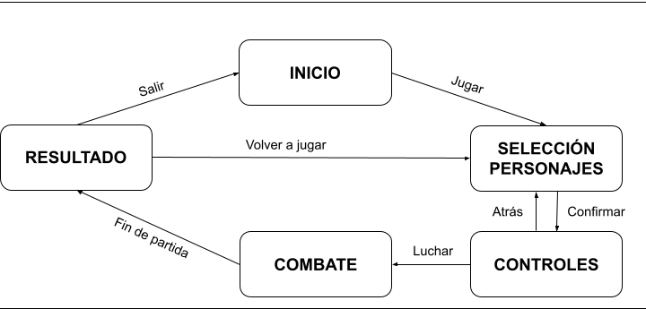
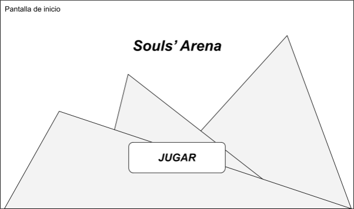
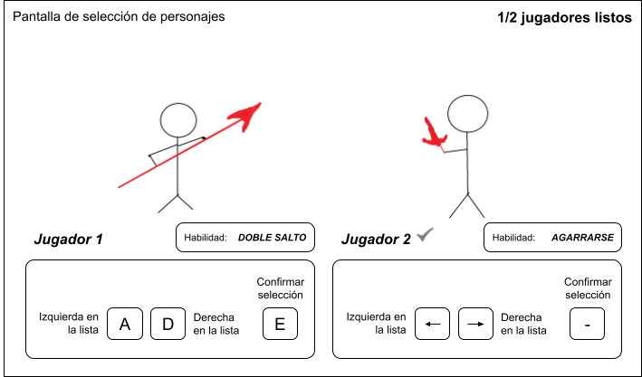
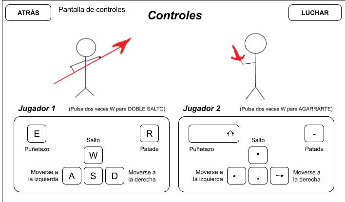
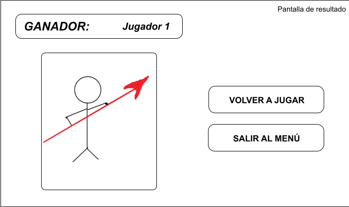

# ***Souls’ Arena***

##### *Documento de Diseño*

 

#### *Grupo 15 - Gehena Games*

##### Andrés Bartolomé Clap Tomás Arévalo Almagro Carlos Dochao Moreno 

 

### **Descripción:** 

Juego de lucha estilo “smash-bros” en el que dos jugadores pelean entre sí de forma local para determinar quien cruza la frontera del inframundo y regresa al mundo de los vivos. Ciertos eventos y plataformas podrán determinarán el curso de las partidas. 

 

### **Género:** 

El juego se clasifica dentro del género de lucha 2Dl, con características de scroll lateral con plataformas. 

 

### **Público objetivo:** 

El público objetivo es amplio, enfocado tanto a jugadores casuales como a jugadores competitivos que disfrutan de la complejidad de los juegos de lucha. 

 

### **Setting:** 

Encarnas a un alma en pena destinada al infierno, donde Hades te ofrece una oportunidad para cruzar la frontera del mundo de los muertos y volver a la vida. Tendrás que luchar cuerpo a cuerpo contra otros gladiadores en un coliseo donde multitud de eventos pueden surgir para finalmente determinar el ganador de la batalla y cruzar la frontera del inframundo. 

 

### **Características principales:** 

- Lucha cuerpo a cuerpo 
- Eventos adversos (el suelo se convierte en lava y sube poco a poco…) 
- Multijugador local (un único dispositivo) 

 

### **Objetivo del juego:** 

El objetivo del juego es luchar contra tu oponente en un tiempo límite hasta dejarle sin vida, ganando así el combate y logrando cruzar al mundo de los vivos de nuevo. 

 

### **Flujo del juego:** 

 

### **Inicio:** 

El juego empieza en el menú de inicio, donde se podrá acceder a la selección de personajes (tras una breve animación) por medio del botón “JUGAR”. 

 

### **Selección de personajes:** 

En la selección de personajes cada jugador podrá elegir un personaje con los controles mostrados y ver la habilidad correspondiente al personaje seleccionado. Una vez confirmadas las selecciones por ambos se procederá a la pantalla de controles. 

 

### **Controles:** 

En la visualización de controles cada jugador podrá ver y probar sus controles correspondientes antes de proceder al combate. Se podrá regresar a la pantalla de selección si se desea. 

 

### **Combate:** 

En la pantalla de combate se encuentra el nivel principal (coliseo infernal). Ambos jugadores jugarán y una vez finalizada la partida pasarán (tras una breve animación) a la pantalla de resultado. 

 

### **Resultado:** 

 

### **Estética y contenido:** 

El apartado visual se inspira en los clásicos juegos de lucha arcade, utilizando un estilo pixel-art de baja resolución para transmitir una estética retro. Se utilizará una paleta de tonos oscuro-rojizos para transmitir esa atmósfera de infierno caótico y oscuro que se pretende reflejar. 

Los jugadores serán representados como gladiadores romanos con prendas perjudicadas y suciedad en el cuerpo, distinguiéndose entre sí un jugador de otro por la diferencia del color de su ropaje. 

En cuanto al escenario, este se sitúa sobre un puente del río Estigia que funciona como coliseo horizontal, por este río circula lava que puede verse en el inferior de la pantalla bajo el puente, en el fondo y alrededor del puente se sitúan las gradas de lo que conforma un gran coliseo. Por último, se ve en el fondo central del coliseo a Hades, que aparece como gran figura divina orquestando el combate. 

 

### **Narrativa:** 

Destinado a la condena eterna, Hades, deidad del infierno, te concede una gran oportunidad: salir victorioso en un combate impredecible sobre el río Estigia para volver a la vida cruzando la frontera del inframundo. 

 

### **Mecánicas:** 

- #### **Personaje 1:** 
  - Movimiento horizontal (A - D) 
  - Salto (W) 
  - Salto doble (provisional) (dos veces W rápido) 
  - Puñetazo (E) 
  - Patada (R) 
- #### **Personaje 2:** 
  - Movimiento horizontal (Izquierda - Derecha) 
  - Salto (Flecha Arriba) 
  - Agarre a paredes (provisional) (dos veces flecha arriba rápido) 
  - Puñetazo (Shift Derecho) 
  - Patada (Guión) 
- #### **Floor is lava:** 

  Cada partida tiene un tiempo limitado de juego de 2 minutos. Al alcanzarse el minuto y medio de partida la lava comenzará a subir por 30 segundos). 

 

### **Interfaz:** 

La interfaz es la básica de un juego de lucha, contando con dos barras de vida y una imagen de cada personaje, en el centro superior un temporizador con el tiempo que queda de partida. Además cuando pasa el minuto y medio aparecerá un texto que diga “The floor is lava!”

 

### **Personajes:** 

Gladiador 1: Es un habitante del infierno sin mucha historia detrás.(provisional) 

Gladiador 2: Es otro habitante del infierno sin mucha historia detrás.(provisional) 

 

### **Niveles:** 

Al ser un videojuego de lucha solo hay un nivel que consiste en un escenario con plataformas en el que se pelearán el uno contra el otro hasta que empiece a subir la lava y tendrán que pelear mientras van subiendo por el escenario para que no les toque.

 

### **Referencias:** 

En cuanto a las referencias, podemos encontrar las claras inspiraciones en los juegos de lucha antiguos como el street fighter, mortal kombat o tekken, pero también en su plataforma podemos encontrar inspiración de los juegos de super smash bros. En cuanto a la ambientación, se inspira en el infierno de Hades. Por último, el apartado visual imita el arte pixel art de las máquinas recreativas antiguas.